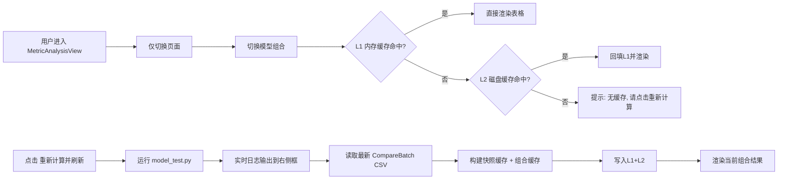
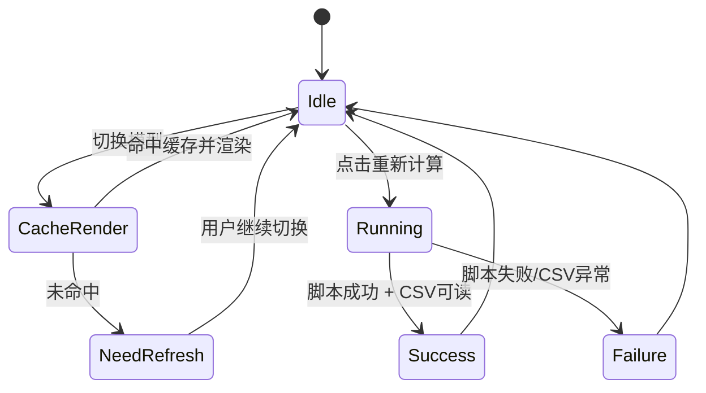

# MetricAnalysisView 缓存与交互设计（可视化）

## 1. 背景与目标

当前 `MetricAnalysisView` 在切换对比模型时会重复运行 `model_test.py`，导致 UI 卡顿与高耗时。

本方案目标：

- 切换模型组合时**不触发重算**，优先秒级显示已缓存结果。
- 仅在用户点击 `start_btn`（"重新计算并刷新"）时运行 `model_test.py`。
- 支持**内存 + 磁盘双层缓存**，重启后仍可快速展示。
- 右侧日志区实时显示运行输出，提升可观测性。

---

## 2. 核心技术选型

- **UI 框架**：PyQt5（`QTableWidget`、`QPlainTextEdit`、`QLabel`）
- **脚本执行**：`subprocess.Popen`（实时读取 stdout/stderr）
- **数据解析**：`csv.DictReader`
- **缓存序列化**：`json`
- **缓存键哈希**：`hashlib.md5`
- **时间戳展示**：`datetime`
- **文件指纹**：CSV `name + mtime + size`

---

## 3. 架构总览



---

## 4. 缓存设计

### 4.1 双层缓存

1. **L1 内存缓存（会话级）**
   - 结构：`self._memory_pair_cache: Dict[pair_key, pair_entry]`
   - 目标：同一运行进程内切换模型秒开。

2. **L2 磁盘缓存（跨重启）**
   - 目录：`results/CurveFaultAResults/metric_cache/`
   - 文件：
     - `latest_compare_batch_snapshot.json`（全量快照）
     - `pair_<md5(pair_key)>.json`（组合级缓存）
   - 目标：程序重启后也能快速读取历史结果。

### 4.2 缓存键

- `pair_key = "CurveFaultA|{model1}|{model2}"`
- pair 文件名使用 md5，避免路径特殊字符问题。

### 4.3 缓存条目结构（pair_entry）

```json
{
  "pair_key": "CurveFaultA|Scratch|Sup-Mig",
  "dataset": "CurveFaultA",
  "model1": "Scratch",
  "model2": "Sup-Mig",
  "csv": {
    "name": "[CompareBatch]CurveFaultA_20260320_183015.csv",
    "path": "...",
    "size": 1234,
    "mtime": 1710920000.0
  },
  "refreshed_at": "2026-03-20 19:30:11",
  "metrics": {
    "mse": ["0.123456", "0.113333"],
    "mae": ["...", "..."],
    "uqi": ["...", "..."],
    "lpips": ["...", "..."],
    "time": ["...", "..."],
    "sample_count": ["--", "--"]
  }
}
```

### 4.4 失效策略

- **手动刷新策略**：不自动过期，不在切换时重算。
- 用户点击 "重新计算并刷新" 后，用新生成 CSV 更新快照与 pair 缓存。

---

## 5. 交互与状态机



### 关键 UI 行为

- `start_btn` 文案改为 **重新计算并刷新**。
- 运行中按钮禁用，防止重复触发。
- 右侧日志框实时追加终端输出。
- 提示区显示来源：`内存缓存(L1)` / `磁盘缓存(L2)` / `快照缓存` / `实时计算`。

---

## 6. 数据流（按事件）

### 6.1 切换模型

1. 更新表头。
2. 依次尝试：L1 pair -> L2 pair -> snapshot 反查组合。
3. 成功则渲染表格并显示来源。
4. 失败则提示“当前组合暂无缓存，请点击重新计算并刷新”。

### 6.2 点击重新计算并刷新

1. 清空日志并写入命令行头。
2. 执行 `model_test.py`，逐行读取输出并显示。
3. 查找最新 `[CompareBatch]CurveFaultA_*.csv`。
4. 构建 snapshot（全量）并落盘。
5. 基于当前模型组合生成 pair_entry，写入 L1/L2。
6. 渲染当前表格，提示来源为“实时计算”。

---

## 7. 异常处理

- 脚本不存在：提示未找到 `model_test.py`。
- 脚本返回非0：提示退出码并展示日志尾部。
- CSV 不存在/空文件：提示输出文件异常。
- alias 不匹配：提示所选模型在 CSV 中缺失。
- 异常时不清空既有缓存，避免页面无数据。

---

## 8. 实施清单（已落地）

- [x] 切换模型不再触发 `model_test.py`
- [x] 点击按钮才触发重算
- [x] 右侧实时日志输出
- [x] L1 内存缓存
- [x] L2 磁盘缓存（snapshot + pair）
- [x] 缓存来源与刷新时间提示
- [x] 运行态按钮禁用

---

## 9. 涉及文件

- `modules/system_reminder/page.py`
- `modules/system_reminder/container.py`
- `docs/plans/2026-03-20-metric-analysis-cache-design.md`
